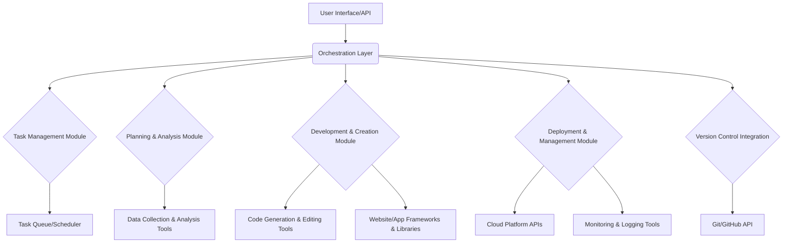

# AI Agent Design Document

## 1. Introduction

This document outlines the design and capabilities of an AI agent intended to automate tasks such as website creation, application development, analysis, planning, and management across various platforms. All development progress will be tracked and managed through the provided GitHub repository: [https://github.com/kevinpranata97/ai-agent](https://github.com/kevinpranata97/ai-agent).

## 2. Core Principles

The AI agent will adhere to the following core principles:

*   **Modularity:** The agent will be designed with a modular architecture, allowing for easy expansion and integration of new capabilities.
*   **Adaptability:** The agent should be able to adapt to different platforms and technologies for website and application creation.
*   **Autonomy:** The agent will be capable of operating with minimal human intervention once a task is initiated.
*   **Transparency:** All actions taken by the agent, and its progress, will be clearly logged and trackable.
*   **Version Control Integration:** Seamless integration with Git and GitHub for tracking all changes and progress.

## 3. Architecture Overview

The AI agent will consist of several key components, each responsible for a specific set of functionalities. These components will interact through well-defined APIs and a central orchestration layer.



## 4. Component Breakdown

### 4.1. User Interface/API

This component will serve as the primary interface for users to interact with the AI agent. It will allow users to:

*   Submit new tasks.
*   Monitor the progress of ongoing tasks.
*   View logs and reports.
*   Configure agent settings.

### 4.2. Orchestration Layer

The orchestration layer is the central nervous system of the AI agent. It will be responsible for:

*   Receiving tasks from the UI/API.
*   Breaking down complex tasks into smaller, manageable sub-tasks.
*   Delegating sub-tasks to appropriate modules.
*   Managing the overall workflow and dependencies between modules.
*   Handling errors and retries.

### 4.3. Task Management Module

This module will manage the lifecycle of tasks, including:

*   **Task Queue:** Prioritizing and queuing tasks.
*   **Scheduler:** Scheduling tasks for execution at specific times or intervals.
*   **Status Tracking:** Maintaining the current status of each task.

### 4.4. Planning & Analysis Module

This module will be responsible for understanding the user's request and formulating a plan of action. Its capabilities will include:

*   **Requirement Analysis:** Parsing and understanding natural language task descriptions.
*   **Resource Identification:** Identifying necessary tools, frameworks, and external resources.
*   **Step-by-Step Planning:** Generating a detailed execution plan for each task.
*   **Data Analysis:** Performing data analysis for tasks requiring insights or reports.

### 4.5. Development & Creation Module

This is the core development engine of the AI agent, capable of:

*   **Code Generation:** Generating code for websites, applications, and scripts.
*   **Code Editing:** Modifying existing codebases.
*   **Framework Integration:** Utilizing various web and application development frameworks (e.g., React, Flask).
*   **Content Creation:** Generating textual and visual content as needed for websites or applications.

### 4.6. Deployment & Management Module

This module will handle the deployment and ongoing management of created assets:

*   **Deployment:** Deploying websites and applications to various hosting environments (e.g., cloud platforms, static hosting).
*   **Monitoring:** Monitoring the health and performance of deployed applications.
*   **Updates & Maintenance:** Performing updates and routine maintenance tasks.

### 4.7. Version Control Integration

This module will ensure that all changes and progress are tracked and committed to the specified GitHub repository:

*   **Repository Cloning:** Cloning the target GitHub repository.
*   **Branch Management:** Creating and managing branches for different tasks.
*   **Commit & Push:** Committing changes and pushing them to the remote repository.
*   **Pull Request Management:** Optionally creating and managing pull requests for review.

## 5. Technology Stack (Initial Thoughts)

*   **Core Logic:** Python (for its versatility and extensive libraries).
*   **Web Frameworks:** Flask (for backend APIs), React (for frontend UI).
*   **Version Control:** GitPython (Python library for Git interaction).
*   **Cloud Integration:** Boto3 (for AWS), Google Cloud Client Libraries (for GCP), Azure SDK (for Azure) - *to be integrated as needed based on deployment targets*.
*   **Database:** SQLite (for internal task management and logging), PostgreSQL/MySQL (for deployed applications).

## 6. Future Enhancements

*   Integration with more development tools and platforms.
*   Advanced natural language understanding for more complex task interpretation.
*   Self-correction and learning capabilities based on past task performance.
*   Support for mobile application development.

## 7. GitHub Repository Structure

The `ai-agent` repository will be structured to accommodate the agent's code, documentation, and task-specific outputs.

```
ai-agent/
├── README.md
├── docs/
│   └── design_document.md
├── src/
│   ├── main.py
│   ├── modules/
│   │   ├── task_management.py
│   │   ├── planning_analysis.py
│   │   ├── dev_creation.py
│   │   ├── deploy_management.py
│   │   └── version_control.py
│   └── utils/
│       └── logging.py
├── tasks/
│   └── <task_id>/
│       ├── input/
│       ├── output/
│       └── logs/
├── tests/
└── requirements.txt
```

This structure will allow for clear separation of concerns and easy navigation within the project.

